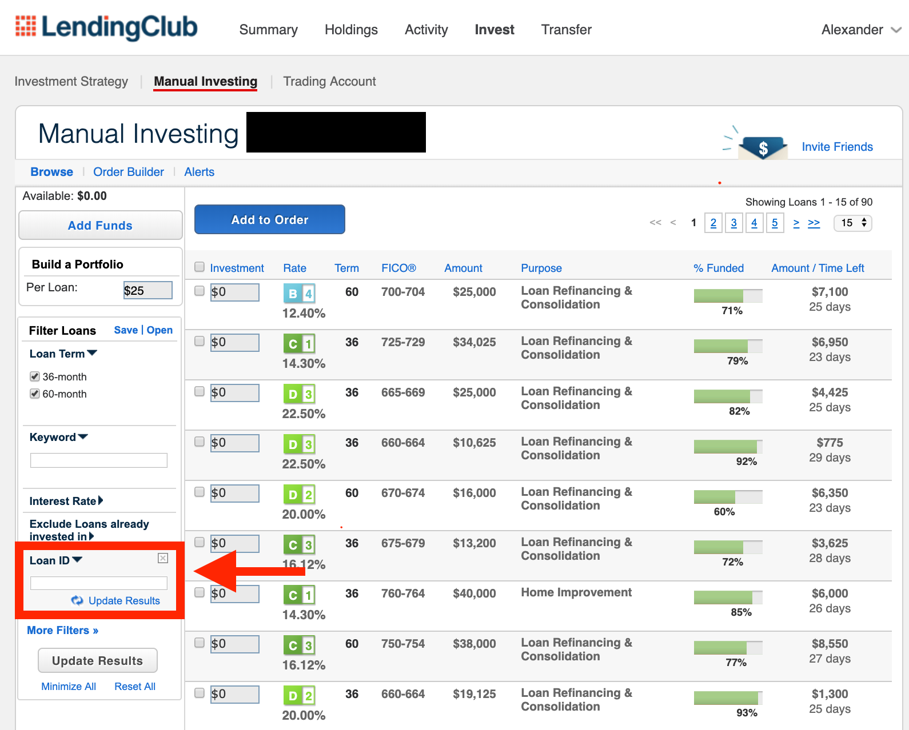

  
(http://www.peervest.online)  
**A P2P Lending Robo-Advisor Using a Neural Network (Classification, Probability of Default) and a Random Forest (Regression, Annualized Returns)**  
*Alex Shropshire*
  
### Business Understanding  
PeerVest helps investors augment their portfolio by intelligently allocating funds to Peer-to-Peer Lending Marketplaces using machine learning to assess risk and predict return, starting with pools of investable loans on LendingClub.com. LendingClub is incentivized to increase marketplace transactions. Driven by ease-of-use, their off-the-shelf credit risk assessments score risk in grouped buckets. On a loan-by-loan basis, this is inefficient given each loan's uniqueness and the sheer amount of data collected. PeerVest recommends the best loans to invest in given a user’s available funds, maximum risk tolerance, and minimum desired annualized return.
  
### Data Understanding  
This technology is being built utlizing publicly available data downloads provided by LendingClub, and going forward I will explore making it dynamic through time utilizing LendingClub & Prosper Marketplace Investor APIs to collect and analyze the large number of loans available for investment on the platforms. Using 1,107 individual loan characteristics and about 1 million samples from 2007-2017, the historical data provided is rich, and perfect for machine learning models. I used a Google Cloud NVIDIA Tesla GPU to train most of my models given the size of my data and computational expense of rapidly iterating through many complex models. I use 2018-Q12019 data to assess my models on future data to ensure it can be used confidently with completely new, investable loan listings.
  
**Download CSVs used in training**: (https://www.lendingclub.com/info/download-data.action)    
**Create LendingClub Account to invest in recommended loans**: (https://www.lendingclub.com/lenderg/createaccount)
  
### Data Preparation  
I utilized all available completed loan results for training models and all current loan listings in need of additional funding in order to recommend investments. Completed loans are already labeled as “Fully Paid” or “Defaulted/Charged Off” based on how the repayment process played out. Current/Active loans are labeled as “current” if they have begun paying off the loan, while data downloaded as "browseNotes" if the loans are still being funded. Despite using CSVs for training, potential investments in partially funded loans can be sourced through an Investor API, or a browseNotes CSV can be downloaded after creating a LendingClub.com account and viewing available investments. There is a class imbalance problem to deal with in training as most loans underwritten by these platforms (~80%) end up getting paid off in full. Additionally, a truly diverse portfolio recommendation would spread funds out among many different loans, but the number of loans looking for investment at any given time varies, and can often be less than 100. Despite in depth analysis of risk and return, a truly well-diversified portfolio would ideally have > 100 loans included.
  
### Modeling  
**Model 1: Classification (Probability of Default (=0), Fully Paid (=1))**  
The main goal was to accurately measure risk on a continuous scale to give more granular context than LendingClub and sites like them provide off-the-shelf. Binary Classification seems to serve this purpose well. Naturally, I tried Logistic Regression. This performed well in many traditional classification metrics, and became really confident in it's assessment of class 0 vs. class 1 decision. To achieve that continuous scale though, I care more about the probability of a loan defaulting vs. probability of a loan being fully paid off. Logistic Regression, despite being calibrated, didn't interact well with the .predict_proba() function. Given 1,107 unique features, there seemed to exist many non-linear relationships and the effort of manually reducing dimensions would be cumbersome. There was no true benefit to using Principal Component Analysis as it was not improving the situation - it reduced dimensionality and reduced explained variance in lockstep. I decided to keep all the features, despite the increased likelihood of feature redundancy. Knowing neural networks would be able to handle this complexity over many epochs of training, I began architecting a model using Keras, a NN library built on TensorFlow. I iterated through many different Keras architectures by employing different combinations of hidden layer sizes, dropout regularization, L2 kernel regularization, early stopping, epochs, class weight balancing, and ReLU/Sigmoid activation functions. Despite some stagnation in validation loss, the model eventually broke through and began improving more significantly within a few epochs, for both train and test sets, while calibrating prediction probabilities very well.  
  
Underperformers: 3 Scikit-Learn Logistic Regression models, 7 Keras Neural Networks  
**Best Performer**: Keras Neural Network v8  
  
**Model 2: Regression (Annualized Return)**  
I used a very simply Annualized Return calculation based on the available data from LendingClub which essentially takes a fraction of Total Payment over Funded Amount, and annualizes by raising that term to the power of 365 divided by the number of days between the last borrower payment and loan issue date plus 30, then taking everything minus 1. I decided against using LendingClub's complicated Adjusted Net Annualized Return computation due to interpretability, though as I continue iterating my model I am open to refined calculations that utilize more traditional financial loss estimates. The element of time as it relates to loan terms and payments sits within this calculation. Macro information like the federal interest rate, inflation and the time value of money is inherent in the interest rate quoted to the borrower, though there is certainly room to dive into time series and survival analysis with increased rigor to productionalize this model for financial institutions. 
  
Linear Regression worked decently on the training set, but was overfit and did not generalize well to the future set or the test set within the same period. Ridge Regression, which is similar but applied L2 regularization fixed the overfitting issue in my 2nd iteration. That said, I wanted to know if my evaluation metrics would improve using something that could make regression decisions in a different way, and if there was a model that wouldn't be as reliant on total payment so that my prediction could be used for brand new listing on LendingClub without payment history. Random Forest was the perfect candidate given the overfitting problem and its proven ability to bootstrap subsamples of features and aggregate many decision trees. In simple terms, a Random Forest would be able to construct and combine many not-so-good models that are not correlated with each other to create a single, decent mode - all while being equipped to handle my 1,107 features without much additional preparation besides finding the best parameters. Given the power of a Google Cloud GPU, I let GridSearchCV handle this by searching for the best combination.
  
Underperformers: 1 Linear Regression model, 3 Ridge Regression Model, 1 Keras Neural Network, 4 Random Forest Regression models (using Scikit-Learn)  
**Best Performer**: Random Forest Regression v5 with GridSearch Cross-Validation  
  
### Evaluation  
**Model 1: Classification (Probability of Default (=0) - Fully Paid (=1) )**:  
**Architecture**:  
Input Layer (1107, Sigmoid) ->  
Dense (1000, Sigmoid, L2) ->  
Dense (300, Sigmoid) ->  
Dense (50, Sigmoid, L2) ->  
Dense Output Layer (1, Sigmoid, L2)    
**Parameters**:  
- Loss: Binary Cross Entropy  
- Optimizer: Adam  
- Early Stopping  
- Class Weight Balancing  
- Batch Size: 5000  

**Evaluation Metrics (Test Error)**:  
- Precision Fully Paid: 0.943  
- Recall Fully Paid: 0.979  
- F-1 Score Fully Paid: 0.961  
- ROC-AUC Score: 0.86  
- Prediction Probabilities calibrated
  
**Model 2: Regression (Annualized Return)**  
**Parameters**:  
- n_estimators = 100  
- max_depth: 15  
- min_samples_leaf: 4  
- min_samples_split: 2

**Evaluation Metrics (Test Error - not including payment history)**:
- R-Squared: 0.56  
- Mean Squared Error: 0.02  
- Root Mean Squared Error: 0.16  
But, we can become much more confident in our prediction if we know something about the borrowers' payment history:  

**Evaluation Metrics (Test Error - if payment history is included)**:  
- R-Squared: 0.97  
- Mean Squared Error: 0.001  
- Root Mean Squared Error: 0.04  

### Deployment  
(http://www.peervest.online)
  
The model has been deployed on the web as a Flask app hosted on an Amazon Web Services EC2 instance, utilizing HTML, CSS, and Brython. It can collect a user’s maximum risk tolerance and their corresponding minimum desired portfolio return, and output a comprehensive list of loans currently live on LendingClub.com based on my model's recommendation.

**Important Terms & Concepts**:  
- **Peer-to-Peer Lending (aka P2P, Crowdlending)**: the practice of lending money to individuals or businesses through online services that match lenders with borrowers. Because of their online-only nature and low overhead, generally, lenders can earn higher returns compared to savings and investment products offered by banks, while borrowers can borrow money at lower interest rates.  
- **Artificial Neural Network**: a computational learning system that uses a network of functions to understand and translate a data input of one form into a desired output, usually in another form. Inspired by the way neurons of the human brain function together to understand inputs from human senses. [Learn More Here](https://www.forbes.com/sites/bernardmarr/2018/09/24/what-are-artificial-neural-networks-a-simple-explanation-for-absolutely-anyone/#7a5465a12457)  
- **Random Forest Model**: an ensemble learning method for classification, regression and other tasks that operates by constructing a multitude of decision trees at training time and outputting the class that is the mode of the classes or mean prediction of the individual trees. [Learn More Here](https://www.kdnuggets.com/2019/01/random-forests-explained-intuitively.html)  
- **Probability of Default**: an estimate of the likelihood that a borrower will be unable to meet its debt obligations. [Learn More Here](https://www.investopedia.com/terms/d/defaultprobability.asp)   
- **Annualized Return**: returns over a period scaled down to a 12-month period. Formula: AR = (xTP / xLA) ^ (365/D) - 1, where xLA is the loan amount, xTP is total payment made by the borrower, and D is the number of days between loan funding and date of last payment. [Learn More Here](https://www.investopedia.com/terms/a/annualized-rate.asp)   
  
**Understanding the Data**:  
- [Download LendingClub's Data Dictionary](https://resources.lendingclub.com/LCDataDictionary.xlsx)  
  
**Shrop Ratio**:  
- Formula: Shrop Ratio = ( Portfolio Returns - Risk-Free Rate ) / Portfolio Dollar Weighted Average Probability of Default   
- Similar to the more popular Sharpe Ratio, the Shrop Ratio instead uses the highly accurate Probability of Default Neural Network model to quantify portfolio risk in the denominator rather than the Sharpe Ratio's typical method of using the standard deviation of historical portfolio returns to quantify volatility. This figure is simply used to compare loans side-by-side on a risk-adjusted return basis, under the assumption that my Probability of Default Neural Network is more indicative of risk than historical standard deviation could possibly be. The higher the Shrop Ratio number, the better the investment according to my process and models.  

**Personal Implementation**  
Next Steps Upon Downloading the Recommendation CSV:  
- Use Loan IDs in the downloaded CSV to guide your investments on LendingClub.com!  
- Click Path: [Click Here](https://www.lendingclub.com/auth/login) > Login (or Create Account) > Invest > Manual Investing > More Filters > Filter by Loan ID > Add $  

  
Optimal Diversification:  
- There are often less than 100 available investments at any given time on LendingClub.com, though an optimized loan portfolio should contain at least 100 different loans to adequately reduce lack of diversification risk 
- From LendingClub: Accounts with fewer than 100 total Notes have been much more likely to see negative returns

**Future App Work - User Stories**  
- As a user, I want to know if the app recommendations will make me more money than the off-the-shelf LendingClub/Prosper recommendations.  
- As a user, I want all new listings to be featured in the recommendation set so that my investment decision is based on recent updates.  
- As a user, I want to be able to filter by loan purpose so that I can curate a mission-driven loan set.  
- As a user, I want to visually see how the each set (1. filtered out set, 2. filtered in set, 3. recommendation set, 4. all listed loans) is diversified across loan purposes, LC/Prosper Risk Grades, Payment Period End Dates, Weighted Average Time Elapsed/Time Left, Weighted Average Probability of Loan Default, Credit Scores, Occupations, Interest Rates, Weighted Average/Effective Interest Rate.  
- As a power user/data scientist/developer, I want see a python code output that I can use to execute my own orders based off of the recommendation set to reduce manual allocation time.  
- As a user, I want to compare how the LendingClub/Prosper Marketplace quotes interest rates over time vs. the federal funds rates over time to see how they correlate and how P2P lending depends on the central bank/greater economy.  
